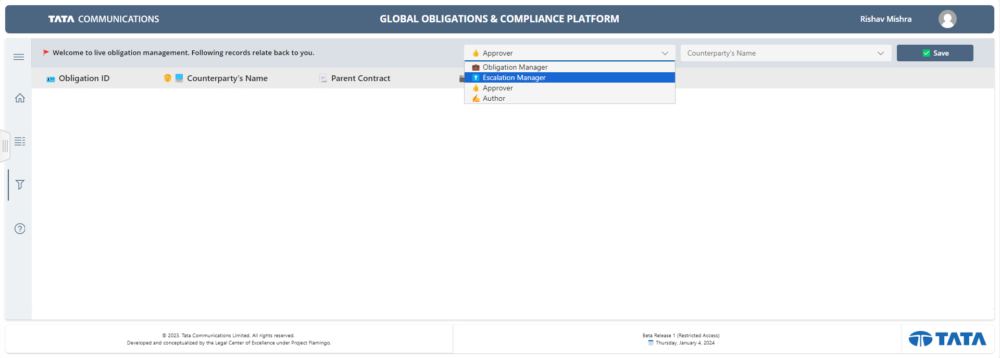

# 4.1 Dashboard

Accessible through the left-side navigation, this page incorporates a gallery with diverse filters (users will be shown only data specific to them where they are approver/manager). Users can select the “Obligation Manager” option to review the data. The gallery comprises of the following columns:

* Obligation ID
* Company Name
* Parent Contract
* Category
* Status

<figure><figcaption></figcaption></figure>
